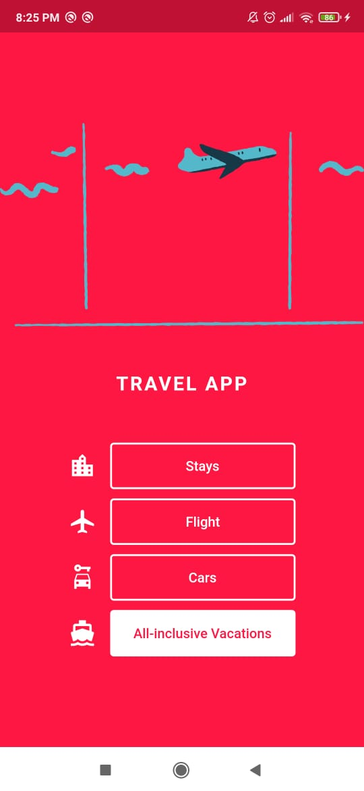

# login_app

This project focus on building the UI through the following widgets:
* Layout
  * Scaffold - wraps a page's content structure
  * SafeArea - wraps content within visible area, i.e. ignoring phone's top/bottom spacings
  * SingleChildScrollView - allows scrolling content vertically
  * Center - center content
  * Column - lay out content vertically
  * Row - lay out content horizontally
  * SizedBox - add spacing either vertically or horizontally

* Widgets
  * Text - text with customizable style
  * Icon - material UI collection of icons with customizable style
  * Image.asset - image loaded locally
  * OutlinedButton - button with a border
  * TextButton - regular button

The challenge is to reproduce a simple Travel App with a suggested UI.
